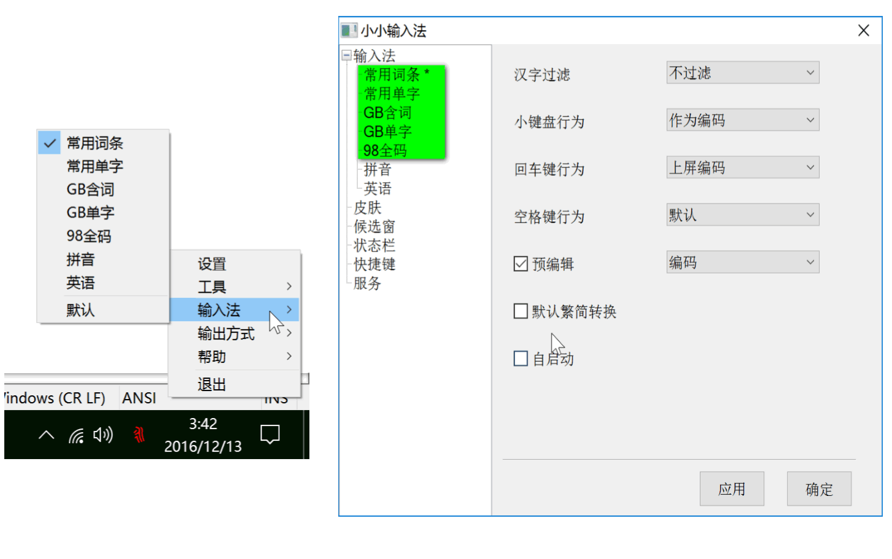

# 98五笔-小小版

## 内置五种码表

## 使用说明：

* 直接外挂使用，双击『98WB』文件夹下的yong.exe；
* 内置使用，与普通的安装输入法等效，是最佳选择，需要在98WB\tsf下写入注册表，但小小输入法不能自动启动，每次使用前，需要双击yong.exe以运行。为方便计，可以将之添加为开机启动项。

## 更多，请参见「使用说明.pdf」,以及「yong.chm」——小小输入法官方帮助文件
